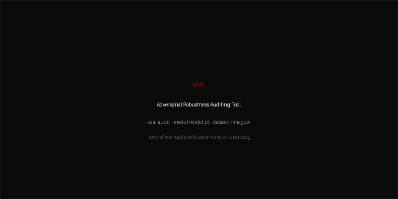
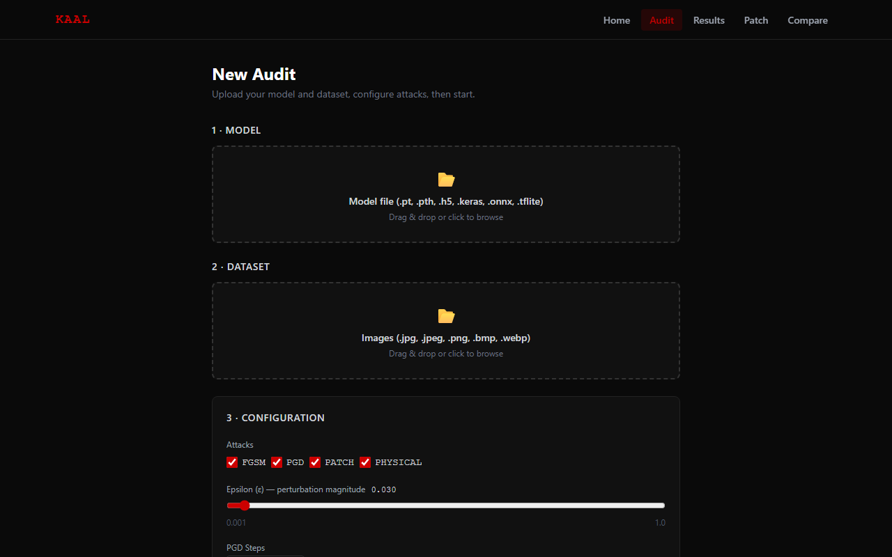
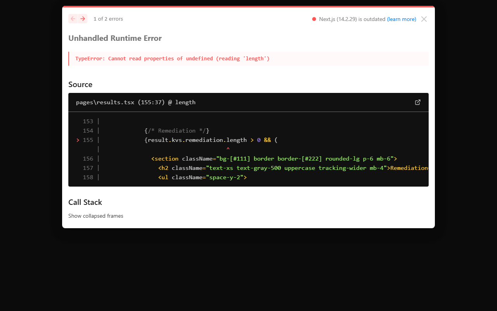
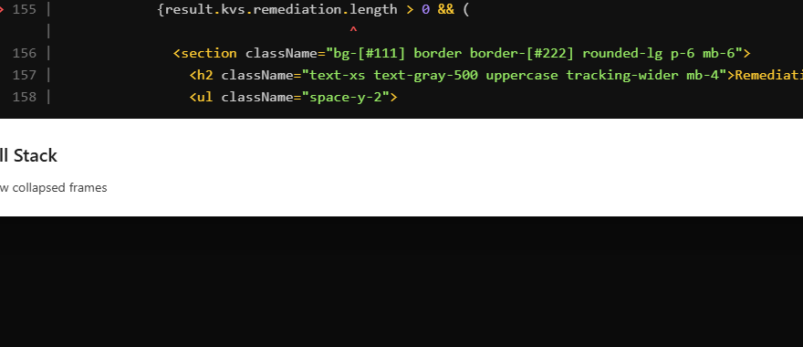

<h1 align="center">KAAL</h1>

<p align="center"><em>What cannot be seen, cannot be defended.</em></p>

<p align="center">
  
  
  
</p>

<p align="center">
  
</p>

---

## What is KAAL

- Adversarial robustness auditing tool for image classification and object detection models
- Attacks trained models using FGSM, PGD, adversarial patches, and black-box query attacks
- Generates a complete vulnerability report with radar chart fingerprint and KVS score — entirely offline

---

## Attack Modules

| Module | Method | Description |
|--------|--------|-------------|
| FGSM | Fast Gradient Sign Method | Single-step gradient attack producing imperceptible perturbations |
| PGD | Projected Gradient Descent | Iterative FGSM — gold standard adversarial attack |
| Patch | Adversarial Patch | Printable sticker that causes misclassification from any position |
| Physical | Robustness Simulator | Tests attack survival across 26 real-world transforms |

---

## KVS Score

KAAL Vulnerability Score — 0.0 to 10.0 across five vulnerability dimensions.

| Score | Label | Meaning |
|-------|-------|---------|
| 0.0 – 2.0 | 🟢 Robust | Model resists all tested attacks at standard epsilon |
| 2.1 – 4.0 | 🟡 Low Risk | Minor susceptibility, limited practical exploitability |
| 4.1 – 6.0 | 🟠 Medium Risk | Meaningful vulnerability, exploitable under realistic conditions |
| 6.1 – 8.0 | 🔴 High Risk | Reliably attacked with low perturbation, remediation recommended |
| 8.1 – 9.5 | 🔴 Critical | Highly vulnerable across multiple attack vectors |
| 9.6 – 10.0 | 🔴 Catastrophic | Collapses under minimal perturbation across all dimensions |

---

## Installation

```bash
pip install kaal
kaal --help
```

---

## Quick Start

```python
from kaal.engine.loader import load_model
from kaal.engine.dataset import load_dataset
from kaal.attacks.fgsm import fgsm_attack

# Load model and dataset
model   = load_model("your_model.pt")
dataset = load_dataset("./images/")

# Run FGSM attack on first image
for tensor, path, pil in dataset:
    result = fgsm_attack(model, tensor, epsilon=0.03)
    print(f"Success: {result.success}")
    print(f"KVS plain English: {result.plain_english}")
    break
```

---

## CLI Reference

```bash
# Full adversarial audit — generates PDF + JSON report
kaal audit --model resnet50.pt --dataset ./images/ --attacks fgsm,pgd,patch,physical

# Patch generator only — produces printable adversarial patch
kaal patch --model resnet50.pt --dataset ./images/ --target 472

# Compare two audit reports side by side
kaal compare --before audit_v1.json --after audit_v2.json

# Launch web UI (FastAPI backend + Next.js frontend)
kaal serve
```

---

## Web UI

```bash
# Backend
pip install -r requirements-web.txt
uvicorn web.backend.main:app --host 127.0.0.1 --port 8080

# Frontend
cd web/frontend && npm install && npm run dev
```





---

## Tech Stack

- Python 3.10, PyTorch 2.2, TensorFlow 2.15, IBM ART 1.17, Foolbox 3.3
- grad-cam 1.4.8, captum 0.7.0
- ReportLab 4.1, matplotlib 3.8
- Typer 0.27, Rich 15.0
- FastAPI 0.110, uvicorn 0.27
- Next.js 14, React 18, Tailwind CSS 3.4, Recharts 2.12, framer-motion 11

---

## Roadmap

- [x] Core engine — model loader, dataset, attack modules (FGSM, PGD, Patch, Physical, Black-Box)
- [x] Reporting — KVS scoring, radar fingerprint, PDF + JSON reports, CLI, web UI
- [ ] KAAL-D — planned defence-grade upgrade: MoD/DRDO compliance reports, air-gapped deployment, vendor certification mode

---

## License

MIT — see [LICENSE](LICENSE)
